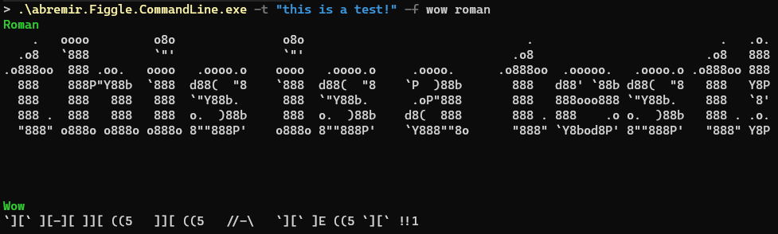

# abremir.figgle.command-line

Command line tool to render text as [figgle](https://github.com/drewnoakes/figgle) banners for the available fonts



## Motivation

Needed a simple way to render text in all, or just some of, the fonts available in [figgle](https://github.com/drewnoakes/figgle).

## Features

* select text to be rendered, or "Hello, world!", e.g. `-t "this is a test!"`
* select which fonts to use, or all, e.g. `-f wow roman`

```text
Description:
  Render text using figgle fonts

Usage:
  abremir.Figgle.CommandLine [options]

Options:
  -t, --text <text>  Specify the text to be rendered. [default: Hello, world!]
  -f, --font <font>  Specify which font(s) will be used to render the text.
  -l, --list         Display list of all Figgle fonts
  --version          Show version information
  -?, -h, --help     Show help and usage information
```

## Dependencies &amp; Acknowledgments

* [command-line-api](https://github.com/dotnet/command-line-api)
* [figgle](https://github.com/drewnoakes/figgle)
* [Pastel](https://github.com/silkfire/Pastel)
* [TableBuilder](./src/abremir.Figgle.CommandLine/TableBuilder.cs) is based on [Console_Menu_Tools/TableBuilder](https://github.com/Grizzly-pride/Console_Menu_Tools)
