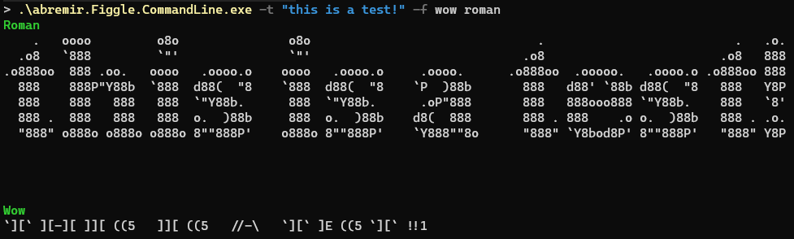

> [!NOTE]
> [drewnoakes] (maintainer of [figgle](https://github.com/drewnoakes/figgle)) has published a website where you can preview all 250+ Figgle fonts in your browser =>  <https://drewnoakes.github.io/figgle/>

# abremir.Figgle.Command-Line

Command line tool to render text as [figgle](https://github.com/drewnoakes/figgle) banners.



## Motivation

Needed a simple way to render text in all, or just some of, the fonts available in [figgle](https://github.com/drewnoakes/figgle).

## Features

```text
Description:
  Render text using figgle fonts

Usage:
  abremir.Figgle.CommandLine [options]

Options:
  -t, --text <text>            Specify the text to be rendered [default: Hello, world!]
  -f, --font <font>            Specify which embedded font(s) will be used to render the text
  -l, --list                   Display list of all Figgle fonts
  -p, --file-path <file-path>  Specify a font file to render the text
  -?, -h, --help               Show help and usage information
  --version                    Show version information
```

## Dependencies &amp; Acknowledgments

* [command-line-api](https://github.com/dotnet/command-line-api)
* [figgle](https://github.com/drewnoakes/figgle)
* [Pastel](https://github.com/silkfire/Pastel)
* [TableBuilder](./source/abremir.Figgle.CommandLine/TableBuilder.cs) is based on [Console_Menu_Tools/TableBuilder](https://github.com/Grizzly-pride/Console_Menu_Tools)
* [More figlet fonts](https://github.com/xero/figlet-fonts/blob/main/Examples.md)
